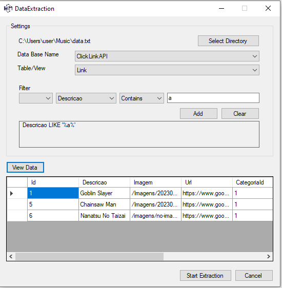

<p align="center">
    <a href="www.linkedin.com/in/alexandrescorreia">
        
    </a>
  
  
  
  
  
  
  
  
</p>

<h4 align="center">
  <p>DataExtraction</p>
  <p>This project aims to perform extractions from a database</p>
</h4>

<p align="center">
  <a href="#technologies">Technologies</a>&nbsp;&nbsp;&nbsp;|&nbsp;&nbsp;&nbsp;
  <a href="#information_source-how-to-use">How to use</a>&nbsp;&nbsp;&nbsp;
  <!-- |&nbsp;&nbsp;&nbsp;
  <a href="#license">License</a> -->
</p>

<p align="center">
  
</p>

## Technologies

This project was developed with the following technologies:

- [C#](https://learn.microsoft.com/pt-br/dotnet/csharp/)
- [Visual Studio Communitye][vsc]

## information_source: How to use

To clone and run this application, you will need [Git](https://git-scm.com) installed on your computer. On your command line:

Make sure you have .NET Framework 4.7.2 installed. If it is not installed, you can download and install it from the [Microsoft website](https://dotnet.microsoft.com/en-us/download/dotnet-framework/net472).

```bash
# Clone this repository
$ git clone https://github.com/AlexandreSCorreia/DataExtraction.git

# Go into the repository
$ cd DataExtraction

#Run the project solution
$ start DataExtraction.sln
```

<!-- ## License

This project is under the MIT license. See the [LICENSE]() for more information. -->

---

<h4 align="center">
    Made with ♥ by AlexandreSCorreia 👋 <a href="www.linkedin.com/in/alexandrescorreia" target="_blank">Get in touch!</a>
</h4>

[vsc]: https://visualstudio.microsoft.com/pt-br/vs/community/
